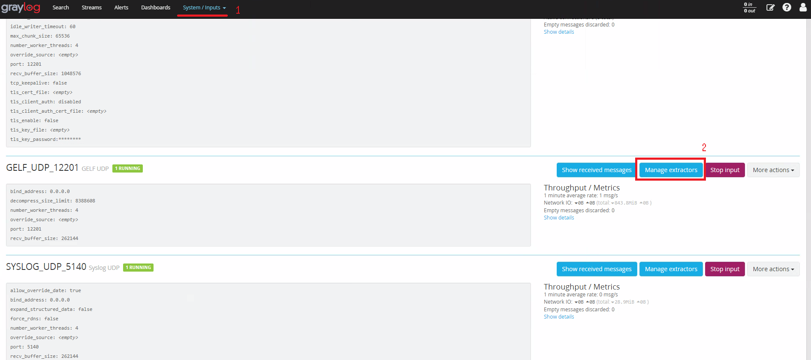
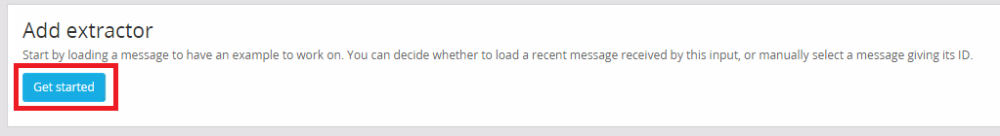
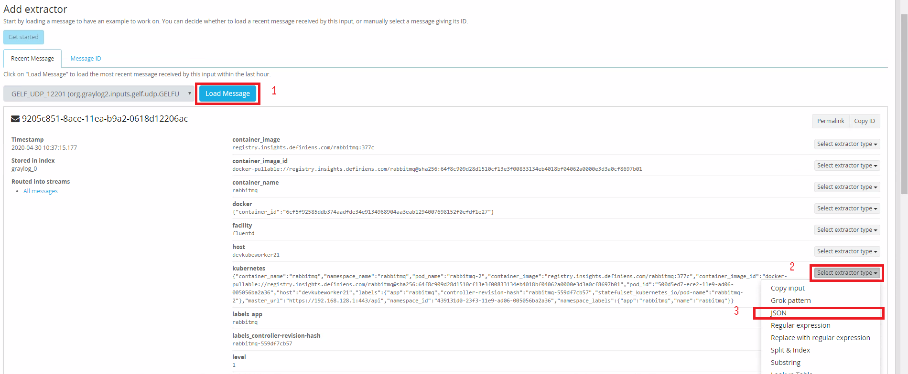
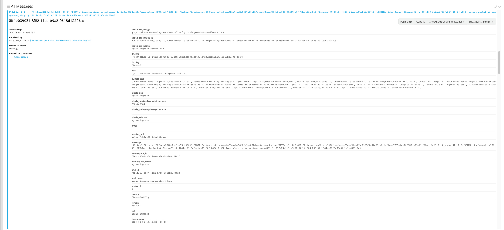

# CENTRALIZAÇÃO DE LOGS DO KUBERNETES COM GRAYLOG + FLUENTD

Neste tutorial será mostrado como centralizar os logs do Kubernetes com Graylog + Fluentd.

Existem outras maneiras talvez mais elegantes, mas optamos em enviar os logs (stdout/stderr) dos pods para o Graylog utilizando o [fluentd-kubernetes-daemonset](https://github.com/fluent/fluentd-kubernetes-daemonset). 
O fluentd(daemonset) irá utilizar as configurações passadas pelo configmap.


### Documentação oficial

- [Graylog](https://docs.graylog.org/en/3.2/index.html#)
- [Fluentd](https://www.fluentd.org/) 
- [Kubernetes](https://kubernetes.io/)

### Versões utilizadas
- Graylog >= 3.1 
- fluentd >= 1.10 


### Pré-Requisitos 
- Cluster kubernetes 
- Servidor Graylog 


## Use sua configuração

Disponibilizamos dois manifestos de configmap.

> fluent-configmap.yaml --> Responsável pelo arquivo de configuração do fluent.conf

> fluent-kubernetes-configmap.yaml --> Responsável pelo arquivo de configuração do kubernetes.conf


Exemplo de como criar um configmap usando como base um arquivo.
```bash 
kubectl create configmap fluent-kubernetes-configmap --from-file=kubernetes.conf --namespace=kube-system

kubectl create configmap fluent-configmap --from-file=fluent.conf --namespace=kube-system
```


## Uso   

- Execute os manifestos do configmap. 
  ```bash
  kubectl create -f fluent-kubernetes-configmap.yaml -f fluent-configmap.yaml
  ```
- Execute o manifesto do rbac.  
  ```bash
  kubectl create -f rbac.yaml
  ```
- Execute o manifesto do daemonset 
  ```bash 
  kubectl create -f fluent-daemonset.yaml
  ```


## Graylog

1. Configure um input gelf. (Protocolo (TCP/UDP) e porta de sua escolha)
2. No Input gelf criado anteriormente, vá em Manager Extractors
  
3. Adicione um extractor
  
4. Load a mensagem e crie um json. 
  
5. Caso não queira realizar os passos anteriores (1-4) manualmente, disponibilizamos um content-pack na pasta `./files/` para criação do input+extractors.
    Necessário apenas importar o content pack e instalar!
6. Exemplo de mensagem 
  


